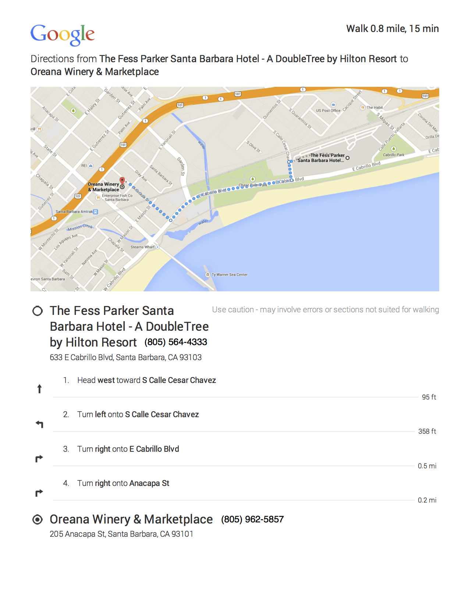



## Program

The [Open Science Codefest](/) is participant-driven, and our process will be guided by the [Open Source Project Guide: Hackathon/Sprint version](https://docs.google.com/document/d/1UGtR_6XWBn4_vo37Kn_hNXmzpwLaSJEZxc8rqFKhy-U/edit?pli=1).  On the first morning, we will organize into sessions by asking session proposers to describe their ideas.  We will then do some 'voting with your feet' to decide which sessions will happen and how long they will persist.  Thus, this program will be updated during the first Meta Session when participants organize into teams, which will be based on the list of [proposed sessions](sessions.html).  Check back here periodically for updates.

- Agenda
    - [Tuesday](#tuesday,-september-2,-2014)
    - [Wednesday](#wednesday,-september-3,-2014)
    - [Thursday](#thursday,-september-4,-2014)
- [Conference Room Layout](#conference-room-layout)
- [Reception at Oreana Winery](#reception)

## Tuesday, September 2, 2014

| Time | Plenary (San Rafael) | BR1: San Rafael (100) | BR2: San Rafael (100) | BR3: Madre North (15)| BR4: Madre North (15)| BR5: Madre South (15)| BR6: Madre South (15)| BR7: Santa Rosa East (20)| BR8: Santa Rosa West (20)| BR9: San Miguel East (20)| BR10: San Miguel West (20)| 
| --- | --- | --- | --- | --- | --- | --- | --- | --- | --- | --- | --- | 
|  8:00 am | Coffee | 
|  8:30 am | Welcome (Jones and Lenhardt) | 
|  8:45 am | Meta Session | 
| 10:00 am | Break | 
| 10:30 am | Block 2 | VizSciData | * | RHESSys | MchnLrngImgs | EcoNicheModel | Moneybee | * | MetaSemantics | PangeaR | ESAOpenSci |
| 12:00 pm | Lunch (Plaza Del Sol)| 
|  1:00 pm | Block 3 | * | * | * | * | * | * | * | * | * | * |
|  3:00 pm | Break | 
|  3:30 pm | Block 4 | * | * | * | * | * | * | * | * | * | * |
|  5:30 pm | [Reception at Oreana Winery](#toc_5) | 

## Wednesday, September 3, 2014

| Time | Plenary (San Rafael) | BR1: San Rafael (100) | BR2: San Rafael (100) | BR3: Madre North (15)| BR4: Madre North (15)| BR5: Madre South (15)| BR6: Madre South (15)| BR7: Santa Rosa East (20)| BR8: Santa Rosa West (20)| BR9: San Miguel East (20)| BR10: San Miguel West (20)| 
| --- | --- | --- | --- | --- | --- | --- | --- | --- | --- | --- | --- | 
|  8:00 am | Coffee | * | * | * | * | * | * | * | * | * | * |
|  8:30 am | Share and Remix | * | * | * | * | * | * | * | * | * | * |
|  9:00 am | Block 1 | * | * | * | * | * | * | * | * | * | * |
| 10:00 am | Break | * | * | * | * | * | * | * | * | * | * |
| 10:30 am | Block 2 | * | * | * | * | * | * | * | * | * | * |
| 12:00 pm | Lunch (Plaza Del Sol)| * | * | * | * | * | * | * | * | * | * |
|  1:00 pm | Block 3 | * | * | * | * | * | * | * | * | * | * |
|  3:00 pm | Break | * | * | * | * | * | * | * | * | * | * |
|  3:30 pm | Block 4 | * | * | * | * | * | * | * | * | * | * |
|  5:30 pm | Adjourn for Day | * | * | * | * | * | * | * | * | * | * |

## Thursday, September 4, 2014

| Time | Plenary (San Rafael) | BR1: San Rafael (100) | BR2: San Rafael (100) | BR3: Madre North (15)| BR4: Madre North (15)| BR5: Madre South (15)| BR6: Madre South (15)| BR7: Santa Rosa East (20)| BR8: Santa Rosa West (20)| BR9: San Miguel East (20)| BR10: San Miguel West (20)| 
| --- | --- | --- | --- | --- | --- | --- | --- | --- | --- | --- | --- | 
|  8:00 am | Coffee | * | * | * | * | * | * | * | * | * | * |
|  8:30 am | Block 1 | * | * | * | * | * | * | * | * | * | * |
| 10:00 am | Break | * | * | * | * | * | * | * | * | * | * |
| 10:30 am | Block 2 | * | * | * | * | * | * | * | * | * | * |
| 11:00 am | Share and wrap up |
| 12:00 pm | Adjourn for Day | 

## Conference room layout

The conference rooms at the Fess Parker are all within easy walking distance of each other.

## Reception

- Tuesday September 2

We are hosting a reception for all registered guests on Tuesday, September 2, 2014. There will be light appetizers and a cash bar, and of course open science!

- __Where__: [Oreana Winery and Marketplace](https://plus.google.com/113520751080009916118/about?gl=us&hl=en), 205 Anacapa St., Santa Barbara ,CA
- __When__: 5:30pm - 7:30 pm, Tuesday, September 2, 2014
- __Getting there__: Walk a little under a mile, about 15 minutes. Directions:

